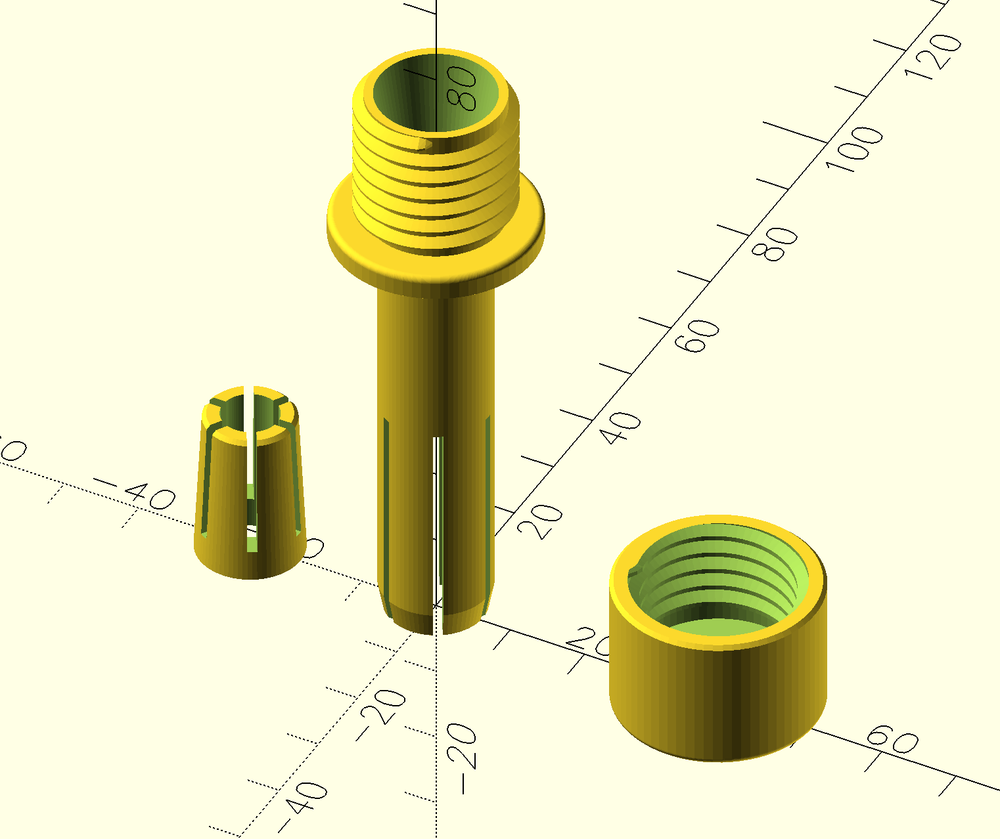

# RO Pipe Anchor

A 3D-printable, three-part pass-through conduit designed to securely route a 1/4" (6.5mm OD) Reverse Osmosis (RO) exhaust/drain tube through a kitchen counter and into a drain pipe below.

## The Problem
Standard RO exhaust lines are often just pushed through a hole in the counter and routed into a PVC drain pipe. Without proper securement, any movement or bumping under the counter can pull the tube out of the drain, leading to water spills. 

## The Solution
This design provides a solid anchor point at the counter level:
1. **Counter Conduit (Part 1):** Sits flush in a 15mm counter hole, extending down to help guide the tube toward the drain. The lower portion features a compressible collet section that self-centers and grips the inside of the counter hole.
2. **Collet (Part 2):** A tapered collet mechanism (similar to a drill chuck or rotary tool) fits into the conduit. The conduit has a taper, so the more you push the collet in, the teeth come together and grip the 6.5mm RO pipe passing through it firmly, preventing it from slipping up or down. 
2. **Cap (Part 3):** Screws onto the top of the conduit, sandwiching the collet. As you tighten the cap, the collet is pushed in, tightening the grip on the pipe.

## Features
* **Adjustable Grip:** The threaded collet design allows you to control exactly how tight the grip is on the pipe without relying on perfect 3D printer tolerances.
* **Parametric Design:** Built in OpenSCAD using the BOSL2 library. Easy to adjust for different counter thicknesses, hole sizes, or tube diameters.

## Printing Instructions
* I use default settings on the Prusa Mini: Generic PLA, 0.15mm QUALITY.
* I prefer to print the conduit with custom supports for the flange, threaded section on top. Don't like supports on threads, which would happen the other way round.

## Assembly Instructions
* Thread the pipe first through the cap, then collet, then conduit.
* Push the conduit into the counter until the flange touches the counter. It should be a firm fit, not too easy to pull out.
  * If it comes off too easily, try a layer of tape on the solid part of the shaft. Or reprint with slightly increased diameter.
  * Future enhancement: Add teeth to the fingers of the conduit so they come out of the hole and expand to grip the bottom surface.
* Route the pipe below the counter wherever you need it to go.
* Push the collet in, screw the cap.
* The cap must be turned just enough so the pipe cannot be dislodged with a simple pull. Avoid overtightening.

## Similar Use Cases
While originally designed for RO water filters, this is effectively a **Panel-Mount Collet Fitting**, **Pass-Through Compression Gland**, or **Bulkhead Tube Strain Relief**. It can be adapted for any scenario requiring a hard plastic tube to be securely routed through a panel or surface:
* **Hydroponics & Aeroponics:** Routing 1/4" irrigation lines or drip-feed tubes through the lids of plastic reservoirs or grow-tent walls to prevent the tube from slipping.
* **Aquarium Systems:** Running rigid airline tubing, CO2 lines, or auto-top-off (ATO) water lines through cabinet tops or aquarium hoods.
* **Pneumatic / Air Lines:** Passing rigid polyurethane air lines through workbench tops or shop walls for compressors and tools.
* **Home Brewing:** Routing gas or liquid lines through the top of a kegerator or a bar counter.

## Dependencies
To modify or render the `.scad` file, you will need:
* [OpenSCAD](https://openscad.org/)
* [BOSL2 Library](https://github.com/BelfrySCAD/BOSL2)

## Credits
Designed in collaboration with Claude Opus 4.6

## License
[MIT License](LICENSE)
